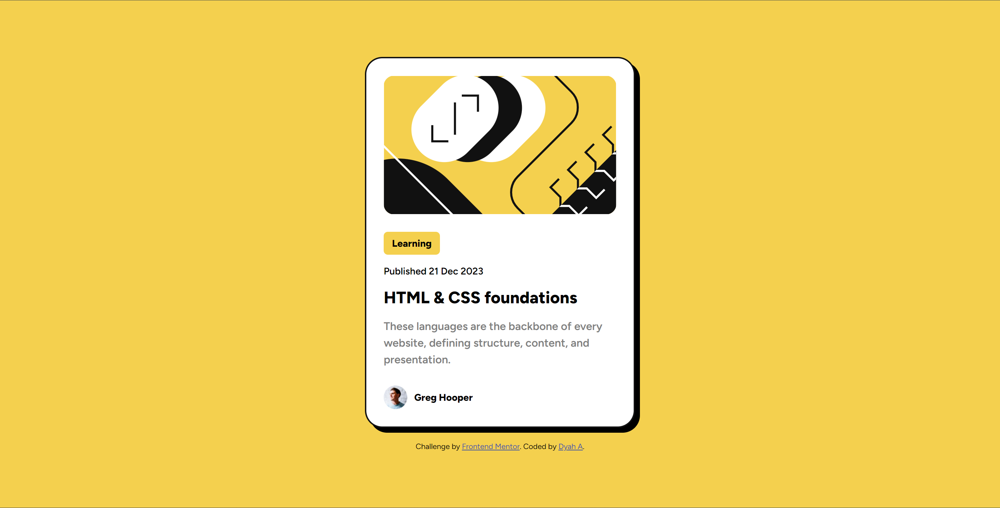

# Frontend Mentor - Blog preview card solution

This is a solution to the [Blog preview card challenge on Frontend Mentor](https://www.frontendmentor.io/challenges/blog-preview-card-ckPaj01IcS). Frontend Mentor challenges help you improve your coding skills by building realistic projects. 

## Table of contents

- [Overview](#overview)
  - [The challenge](#the-challenge)
  - [Screenshot](#screenshot)
  - [Links](#links)
- [My process](#my-process)
  - [Built with](#built-with)
  - [What I learned](#what-i-learned)
  - [Continued development](#continued-development)
  - [Useful resources](#useful-resources)
- [Author](#author)

**Note: Delete this note and update the table of contents based on what sections you keep.**

## Overview

### The challenge

Users should be able to:

- See hover and focus states for all interactive elements on the page

### Screenshot

### Links

- Solution URL: [FeM_BlogPreviewCard](https://github.com/arumdyaharum/FeM_BlogPreviewCard)
- Live Site URL: [https://arumdyaharum.github.io/FeM_BlogPreviewCard](https://arumdyaharum.github.io/FeM_BlogPreviewCard)

## My process

### Built with

- Semantic HTML5 markup
- CSS custom properties
- Flexbox
- CSS Transition

### What I learned

It's been a long time not code for frontend so my workflow was depending on what I've remembered and searching for documentation. I learned that I still have ability to code quickly. I code this website just for an hour. I also learned that my ability to translate design image into code is more accurate than I used to. Last but not least, I learned how to make animation hover which I added transition duration on base css and any hover properties will transform within transition duration.

### Continued development

Nothing to do here. It's just a simple website.

### Useful resources

- [W3School](https://www.w3schools.com/) - This helped me for read documentation of CSS.

## Author

- Frontend Mentor - [@arumdyaharum](https://www.frontendmentor.io/profile/arumdyaharum)
- Twitter - [@arumdyaharum](https://www.twitter.com/arumdyaharum)
